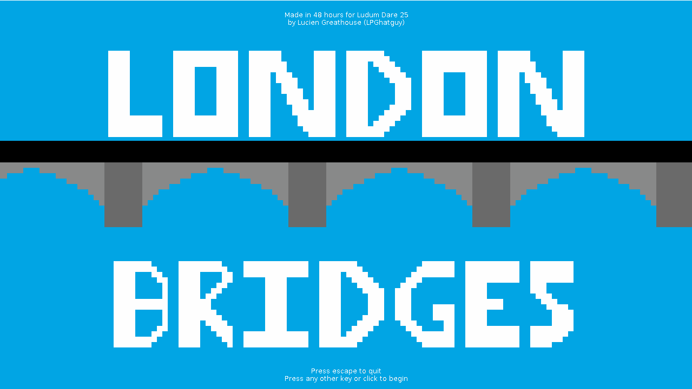
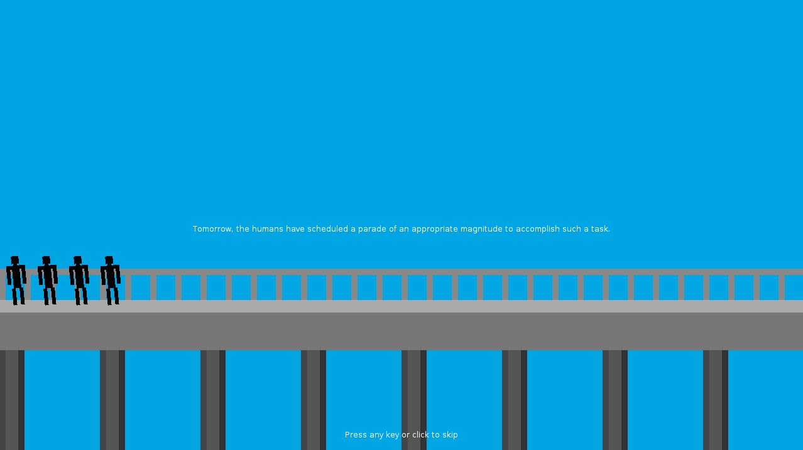
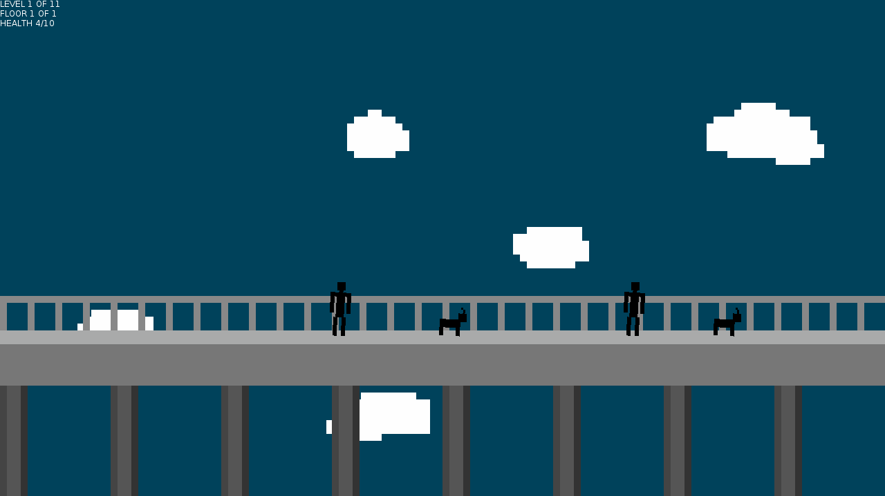

# [Ludum Dare 25: London Bridges](http://ludumdare.com/compo/ludum-dare-25/?action=preview&uid=14296)
This was my entry for the Ludum Dare 25 Compo, which took place December 14th-17th 2012. The jam's theme was **You are the Villain**.

This game was built using [LÖVE](https://love2d.org/) 0.8.0.

Original submission description:

> In London Bridges, you play as a bridge near the end of its life. People are trying to cross your bridge, but you decide it's best for you if you throw them off so they fall to their death in the whirl pool below.
>
> All sounds (even the goats and birds) were me, and all the music is played on one of two baroque recorders.

Original submission screenshots:

## License
London Bridges is available under the terms of the MIT license. See [LICENSE.txt](LICENSE.txt) or <https://opensource.org/licenses/MIT> for details.